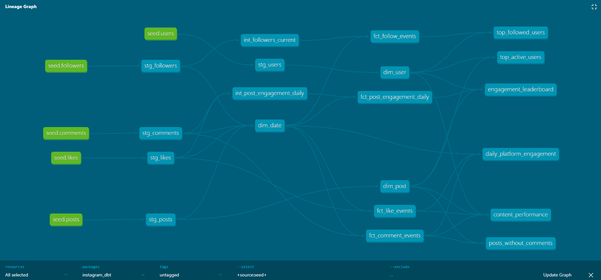
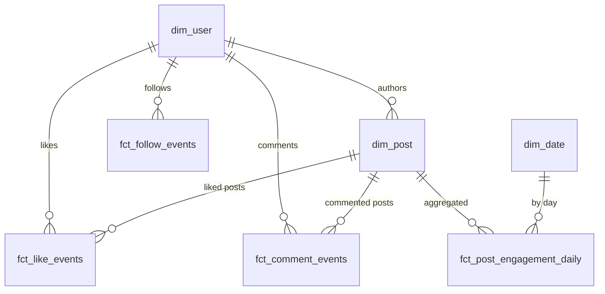

# Instagram dbt

A clean, seed-first **dbt** project modeling a simplified Instagram social graph (users, posts, comments, likes, followers) using a local **DuckDB** file.  
The project demonstrates dbt best practices: **staging → intermediate → marts**, plus ad-hoc analysis queries.

---

## What’s Inside

```
.
├─ models/
│  ├─ sources/         # _sources.yml pointing to seeded tables
│  ├─ staging/         # clean, type-cast source data (views)
│  ├─ intermediate/    # rollups: followers, daily engagement (views)
│  ├─ marts/           # star schema dims & facts (tables)
│  └─ analysis/        # ad-hoc queries (views)
├─ seeds/              # small synthetic CSV data
├─ macros/             # (optional) helpers
├─ dbt_project.yml     # dbt config
└─ profiles.example.yml
```

**Marts (star schema)**
- **Dimensions**: `dim_user`, `dim_post`, `dim_date`  
- **Facts**: `fct_like_events`, `fct_comment_events`, `fct_follow_events`, `fct_post_engagement_daily`

**Materializations**
- `staging/` → **view**  
- `intermediate/` → **view**  
- `marts/` → **table**  
- `analysis/` → **view**

---

## Requirements

Add these to `requirements.txt` (or install directly):

```
dbt-duckdb==1.9.*
duckdb==1.3.*
```

---

## Quickstart

1) **Create a virtual environment and install**
```bash
python -m venv .venv
# Windows (Git Bash)
source .venv/Scripts/activate
pip install -r requirements.txt
```

2) **Configure your profile**  
Copy `profiles.example.yml` to your dbt profiles dir:

- macOS/Linux: `~/.dbt/profiles.yml`  
- Windows: `%USERPROFILE%\.dbt\profiles.yml`

**profiles.yml**
```yaml
instagram_dbt:
  target: dev
  outputs:
    dev:
      type: duckdb
      path: ./instagram.duckdb   # created by dbt
      schema: instagram          # default schema for non-overridden models
      threads: 4
```

3) **Build**
```bash
dbt debug
dbt seed
dbt run
dbt test
```

4) **Explore docs & lineage**
```bash
dbt docs generate
dbt docs serve
```

---

## Example Queries

**Top followed users**
```sql
select u.name, count(*) as followers_count
from marts.fct_follow_events f
join marts.dim_user u on u.user_id = f.followee_user_id
group by u.name
order by followers_count desc;
```

**Daily active users (likers & commenters)**
```sql
select d.date_day,
       count(distinct l.liker_user_id)     as active_likers,
       count(distinct c.commenter_user_id) as active_commenters
from marts.dim_date d
left join marts.fct_like_events    l on d.date_id = l.date_id
left join marts.fct_comment_events c on d.date_id = c.date_id
group by d.date_day
order by d.date_day;
```

**Content engagement leaderboard**
```sql
select p.post_id,
       u.name as author,
       count(distinct l.liker_user_id)     as total_likes,
       count(distinct c.commenter_user_id) as total_comments
from marts.dim_post p
join marts.dim_user u on p.user_id = u.user_id
left join marts.fct_like_events    l on p.post_id = l.post_id
left join marts.fct_comment_events c on p.post_id = c.post_id
group by p.post_id, u.name
order by total_likes + total_comments desc, p.post_id
limit 10;
```

---

## Run queries in DuckDB

Open the DuckDB CLI in your project folder:
```bash
./duckdb instagram.duckdb
```

List tables:
```sql
SELECT table_schema, table_name
FROM information_schema.tables
WHERE table_schema IN ('staging','intermediate','marts','analysis')
ORDER BY 1,2;
```

---

## Lineage Graph

Here’s the dbt lineage view of the project:



---

## Schema Diagram



*Star schema ERD: dimensions (`dim_user`, `dim_post`, `dim_date`) connect to fact tables (`fct_like_events`, `fct_comment_events`, `fct_follow_events`, `fct_post_engagement_daily`).*

---

## Notes

- Synthetic sample data only (no real Instagram data).  
- Seeds are intentionally small; you can generate larger volumes locally if desired.  
- Follows dbt best practices: **staging → intermediate → marts** with tests on keys & relationships.

---