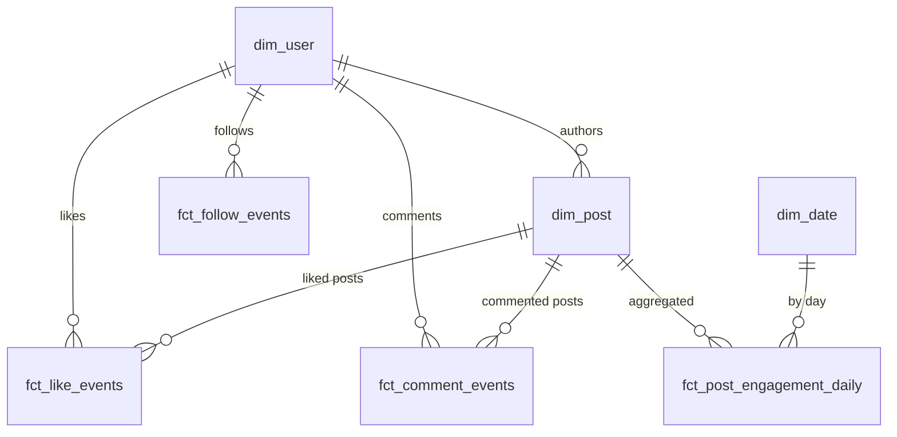

# Instagram dbt

A clean, seed-first **dbt** project modeling a simplified Instagram social graph (users, posts, comments, likes, followers) using a local **DuckDB** file.

## What's Inside
- **seeds/** — CSV seeds (users, posts, comments, likes, followers)
- **dbt_project.yml** — dbt project config
- **models/**
  - **staging/** — clean, type-cast seed data
  - **intermediate/** — rollups (followers count, daily engagement)
  - **marts/** — star schema
    - **Dims**: `dim_user`, `dim_post`, `dim_date`
    - **Facts**: `fct_like_events`, `fct_comment_events`, `fct_follow_events`, `fct_post_engagement_daily`
  - **analysis/** — ad-hoc queries (e.g. top followed users, posts without comments, likes per post)

## Quickstart

1. Create a virtual environment and install dependencies
```bash
python -m venv .venv
source .venv/Scripts/activate   # Git Bash on Windows
pip install -r requirements.txt
```

2. Configure your profile
- Copy `profiles.example.yml` to `~/.dbt/profiles.yml`  
  (Windows: `%USERPROFILE%\.dbt\profiles.yml`).

3. Build the project
```bash
dbt debug
dbt seed
dbt run
dbt test
```

4. Explore docs and lineage graph
```bash
dbt docs generate
dbt docs serve
```

---

## Schema Diagram (Mermaid)

